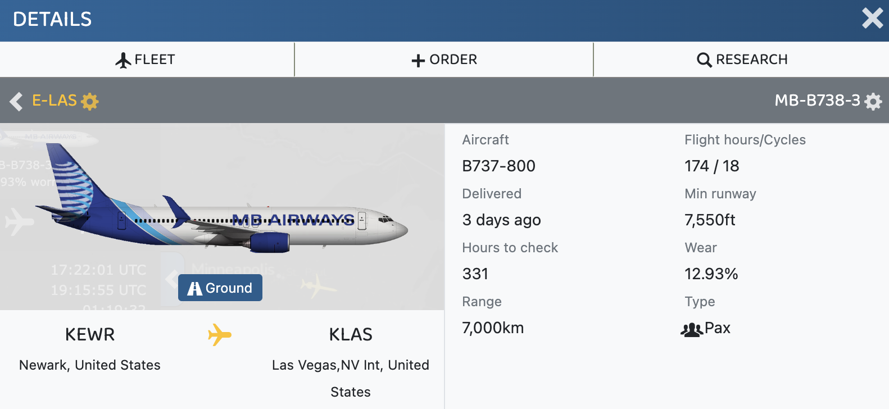
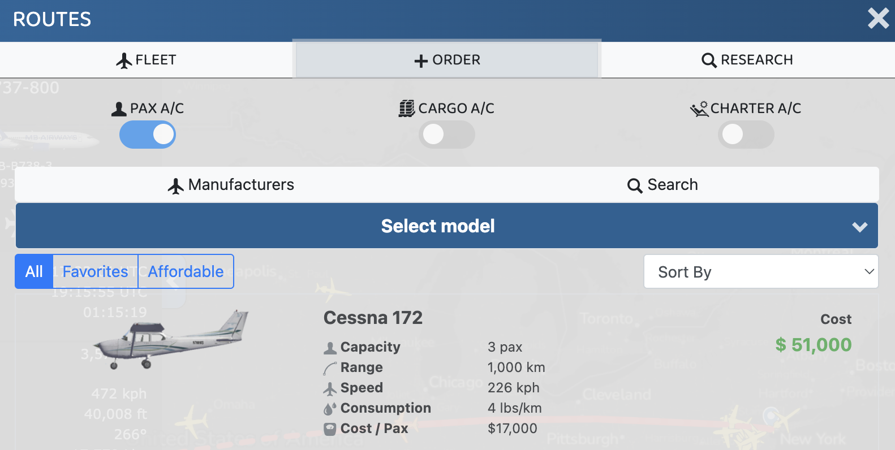
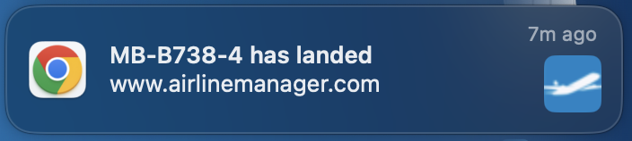
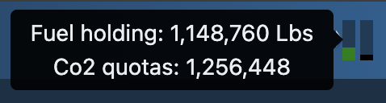
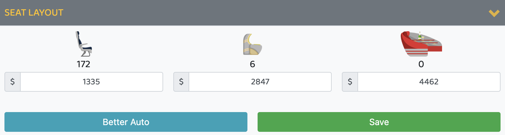

# Airline Manager 4 (AM4) UI Enhancement Script

## Table of Contents
- [📖 Introduction](#introduction)
- [⚙️ Installation](#installation)
- [✨ Features](#features)
  - [🎨 Custom Liveries](#-custom-liveries)
  - [✈️ Order Screen Enhancements](#-order-screen-enhancements)
  - [🔔 Browser Notifications](#-browser-notifications)
  - [⛽️ Better Fuel and Co2 Tooltip](#-better-fuel-and-co2-tooltip)
  - [💰 Better Auto Price](#-better-auto-price)
  - [🔈 Immersive Sounds](#-immersive-sounds)
  - [🚫 Hide Game Ads](#-hide-game-ads)
- [💖 Support](#support)
- [📄 Legal](#legal)

## Introduction
The **AM4 UI Enhancement Script** is your co-pilot for Airline Manager 4, with both **U**sability and **I**mmersion improvements to the game.

### What This Is

AM4-UI is an free, open source [userscript](https://en.wikipedia.org/wiki/Userscript) designed to improve quality-of-life within the game as well as realism and roleplay potential. I've opted for a userscript to maximize compatibility across devices and browsers and save on development time. However, since userscripts only work in the browser, this means that **AM4-UI is only compatible with the web version of the game, not the mobile app**. 

### What This Isn't

AM4-UI is not a bot. It does not automate any functions of the game. Automation and bots go against the spirit of AM4 and are prohibited by the Terms of Service. While this script does not fall under those categories, you should use it at your own risk. 

Additionally, AM4-UI does not collect any personal data or access files on your computer.

### Support Me

**If you enjoy this and would like to support my work, feel free to leave a tip via [PayPal](https://paypal.me/mattbrauner)**

## Installation
1. Install a userscript manager for your browser, such as [Tampermonkey](https://www.tampermonkey.net/).

1. Once installed, open the [GitHub Raw Link](https://raw.githubusercontent.com/mb4828/am4-ui-enhancement-script/refs/heads/main/script.user.js) for `script.user.js`.

1. **Auto-install** &mdash; If you're using Tampermonkey, it will automatically ask you if you want to install the script. This is the best way to install it, as it will automatically fetch updates when they are published to GitHub.

1. **Self-install** &mdash; If you prefer to self-install, simply copy/paste the raw script into your userscript manager.

1. Open AM4 and refresh the page. If the script is running successfully, you'll hear a ding-dong chime and see `Starting AM4 Usability & Immersion` in the browser console. You must click somewhere on the screen to hear the chime. If you don't hear the chime or see the text in the browser console, check the troubleshooting steps for your userscript manager.

## Features

### 🎨 Custom Liveries

Allows you to override default aircraft images with custom liveries.

To use, click on any aircraft picture and enter a URL to the image you'd like to replace it with.

To remove a custom image, click on the aircraft and enter a blank URL.

For help creating liveries, see my guide [here](https://github.com/mb4828/am4-ui-enhancement-script/wiki/How-to-make-a-custom-aircraft-livery-using-Pixlr).

Caveats:
1. Only works on your device and is not visible to other players.
1. If you're using multiple devices, you will have to set up the images on each device, as there is no syncing capability.
1. Some aircraft share the same image. Updating the image for an aircraft with a shared image will change it for all aircraft using that image.
1. You must have the image uploaded somewhere to use it, such as [ImgBB](https://imgbb.com/).

### ✈️ Order Screen Enhancements

Includes the following improvements to the order screen:
- Cleans up the list of stats to make it more readable
- Adds the ability to Favorite aircraft.
- Adds Cost per Passenger for quicker side-by-side comparisons.
- Adds filtering to show all, favorites, or only affordable aircraft.
- Adds sorting to organize aircraft by desired stats (e.g., cost, capacity, range).

### 🔔 Browser Notifications

Displays browser notifications when aircraft land or park, allowing you to work on other tasks without missing anything. If your sound is on, a ding will also be played.

To enable, click "Allow" when the popup appears asking if you want to permit notifications.

### ⛽️ Better Fuel and Co2 Tooltip

The Fuel and Co2 popup now shows the fuel and Co2 levels without having to open the fuel page.

### 💰 Better Auto Price

Automatically applies recommended multipliers (1.1, 1.08, 1.06) to the auto price button, boosting profit. Not a substitute for the Discord bot, but maybe someone can help make this better in the future.

### 🔈 Immersive Sounds
Adds the following sound effects:
- Double ding on load to indicate that AM4-UI is running
- Single ding on aircraft landing or parking so you won't miss anything (only if you have notifications enabled)
- Pilot PA announcement for departing aircraft

I may add more in the future &mdash; I don't want it to be too annoying.

### 🚫 Hide Game Ads
Removes annoying advertisements for other games from the interface.

## Support
Bugs or feature requests can be raised through [GitHub](https://github.com/mb4828/am4-ui-enhancement-script/issues). I sadly don't have time to respond to issues raised elsewhere (Reddit, Discord, etc).

Pull requests are always welcome!

## Legal

Copyright &copy; 2025 Matt Brauner

This program is free software: you can redistribute it and/or modify
it under the terms of the [GNU General Public License](LICENSE) as published by
the Free Software Foundation, either version 3 of the License, or
(at your option) any later version.

This program is distributed in the hope that it will be useful,
but WITHOUT ANY WARRANTY; without even the implied warranty of
MERCHANTABILITY or FITNESS FOR A PARTICULAR PURPOSE.  See the
GNU General Public License for more details.

For legal requests, I can be reached at matt[at]mattbrauner.com.

